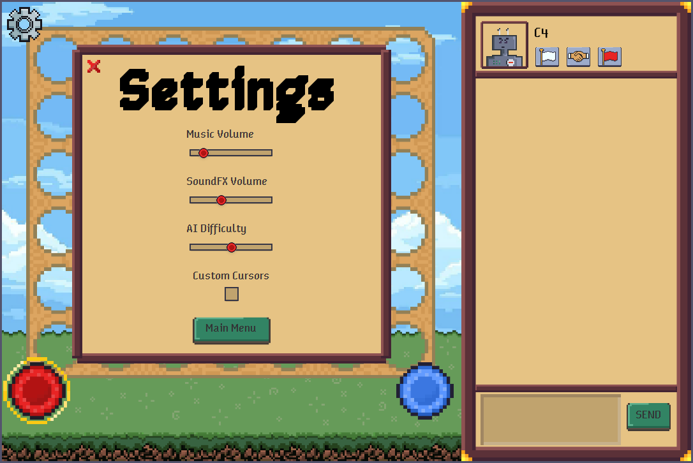

# Connect Four
A online connect four game! "Connect" and chat with friends, battle them in this high-intensity game, or fight `C4` (our sassy AI).

## Main Menu:

Choose between local PVP, online, or versus AI.


## Play Online!

### Connecting to a Server

Add a new connection or connect to a server. (with input validation!)

<p float="left">
    
    
</p>

### The server menu and playing online
Keep track of your rank, change your profile picture, and keep up with friends at the server menu

The leader board can display the global top ten, your local rank (where in the global leader board you rank), and how you rank among your friends.

<p float="left">
    
    
</p>

Keep track of your friends list, and get notifications when they are online! Once they are, you can chat with them or send them a game invitation.

<p float="left">
    
    
</p>

Our chat supports markdown `**bold**` and `:emojis:`!
Players invited to games get a notification and can accept!

<p float="left">
    
    
</p>

Chat with your opponent during the game! You can also, surrender, request a draw, or even request that your opponent surrender! In your opponent's profile, you can view their ELO or add them as a friend

<p float="left">
    
    
</p>

## Play `C4`, our AI

`C4` uses a min-max decent algorithm to a certain depth determined by the set difficulty. Anything past ~5 is a real challenge!

<p float="left">
    
</p>

`C4` will send you taunting messages but its difficulty can be adjusted via the settings pane. When `C4` is set to their maximum difficulty, you can see their pulsating brain and the screen is engulfed in flames!

<p float="left">
    
    
</p>

### Running and Building
To play our game, clone this repository, navigate to the `client` directory, and run `mvn compile exec:java`.

```
git clone https://github.com/samp5/connect-four && cd client && mvn compile exec:java
```

If you have a server running you can add a connection in the connections menu and login to play online!

### Starting a Server

To start a server, clone this repository, navigate to the `server` directory and run `mvn compile exec:java`.

```
git clone https://github.com/samp5/connect-four && cd server && mvn compile exec:java
```

If you want to serve the server on a port other than 8000, edit the value at `server/src/main/java/network/ClientManager.java:26`


Give your friends your IP address and start playing!
